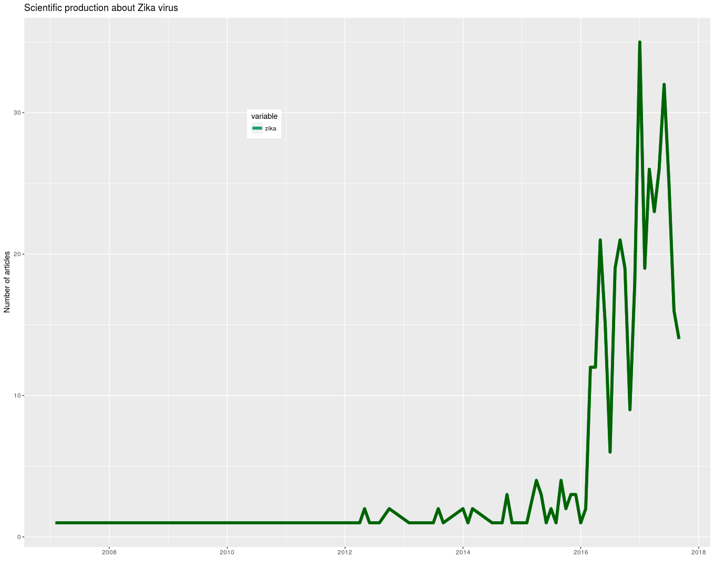

# MMSS Web Mining Projects

This site is designed to accommodate mining projects of the social web, carried out by the Department of **Mathematical Modeling of Social Systems**, **Institute for Research on Applied Mathematics and Systems**. 

## GDELT Project Mining

The first project consists of mining of the GDELT project to find all the web sites that have been written on the Zika virus since the GDELT project began on January 1, 1979. 

This project is funded by the projects:

**"Uso y Diversidad de la web Social en la Producción y Comunicación de Conocimiento Científico y Tecnológico en Áreas Emergentes. Un Estudio Exploratorio en la UNAM. PAPIIT IA301016"**
and

**"Geografías de las Ciencias y Tecnologías Emergentes en México. PAPIIT IA300916"**

As any Data Science project Pipeline, this project follows *almost* all phases of the **OSEMN** pipeline model:

**O — Obtaining our data**

This phase is carry on by means of the **GDELTmining.py** python script, which searches GDELT project database by using keywords introduced as parameters from the input device.

It generates a directory **CSVfiles** containing the retrieved files which URL matches the keywords. Inside such directory, all web sites generated that day are retrieved in a zipped file, which is unzipped and the URL line is saved, then the URL's web site is retrieved in full text and saved into a subdirectory **TXTfiles**.

The script also generates a log file containing statistics **URLstats.txt**.

**S — Scrubbing / Cleaning our data**

The data cleaning phase is done with the **authlistgen.py** python script to generates a list of authors by complete name taken from the database of authors generated with Web of Science utility.

The list of edited names is saved in the generated file **authorslist.csv**.

**E — Exploring / Visualizing our data will allow us to find patterns and trends**

This is carry on with the **minefiles.py** python script, which is the main script of the project as it is in charge of retrieving all matches between the authors' names and full text of each one of the files in the subdirectory **TXTitems**.

It generates a report file **report.csv**.

With the data explored, visualizing objects can be generated, like this timeline which shows the trends in web news based on scientific sources.

**M — Modeling our data will give us our predictive power as a wizard**

Since this is not a Predictive Analytics project, this phase was not performed, although we already have the necessary data for further analysis. 

**N — Interpreting our data**

Statistics on the findings about this project, are carried out with  **uniqueauth.py** python script, which embed three functions to generate:

1. a list of unique authors saved in the generated file **uniqueauthors.csv**
2. all sites that cite an author from the list, this is saved in the **sitelistingauthors.csv**´
3. and a list of counted authors and the URLs citing them, this is saved in the generated file **report.csv**.

